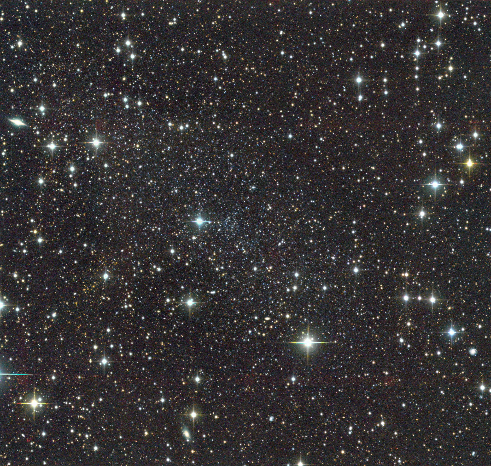

# Background & Past Work

- What is dark matter? Why do we look at dwarfs?
- Forms of dark matter, lambda-CDM, and dwarf galaxies
- How does gravity affect dwarfs, theory of tidal perturbations
  - @EN2021, @PNM2008, etc.
- Instances of dwarfs undergoing weird processess
- Alternative processes and uncertainties in the evolution of dwarfs

The classical dwarfs are some of the earliest discovered systems, begining with @shapley1938

## Cosmological context

{#fig:cosmological_power_spectrum width=100% }

Figure: figure 1 from @bechtol+2022. 

Figure: Density profiles of comological simulated halos, matching approximantly the NFW formula. 

## Sculptor

{#fig:scl_image width=390pt height=390pt}

Figure: Sculptor image from DES DR 2 via HiPS2FITS.

{#fig:toy_profiles}

Figure: Sculptor and UMi's profiles are well-matched to @PNM2008.  

Sculptor (Scl) is one of the first discovered dwarf galaxies of the Milky Way (Shapley 1938; only preceded by the SMC and LMC!). As a classical dwarf spheroidal, Scl is relatively bright and compact. 

Since the initial discovery of Scl, most authors have noted that Scl has a slight ellipticity ($0.36$), often attributed to tidal effects. However, this does not align with the absolute proper motion or orbital path of the galaxy. 

While Scl has a relatively large pericentre (greater than 50kpc), @sestito+2023a detect that the galaxy likely has an excess of stars in the outskirts (past about 60 arcminutes). This excess is perhaps one of the clearest indications that Scl may be affected by tides. Here, our goal is to determine if under a $\Lambda$ CMD paradigm with DM-only simulations, tidal effects of the Milky Way (or LMC) may indeed be consistent with these observations, or if these observations may reveal instead a extended stellar "halo" or second component of the galaxy—illustrating a complex formation for the galaxy.

Theoretical work on Sculptor

- @battaglia+2008
- @iorio+2019

Observational work on Scl

- @sestito+2023a
- @tolstoy+2023, @arroyo-polonio+2023, @arroyo-polonio+2024
- @eskridge1988

| parameter                | value                                                        | Source            |
| ------------------------ | ------------------------------------------------------------ | ----------------- |
| $\alpha$                 | $15.0183 \pm 0.0012$˚                                        | M+18              |
| $\delta$                 | $-33.7186 \pm 0.00072$˚                                      | M+18              |
| distance                 | $83.2 \pm 2$ kpc                                             | Tran+22           |
| $\mu_\alpha \cos \delta$ | $0.099 \pm 0.002 \pm 0.017$ mas yr$^{-1}$                    | MV20a             |
| $\mu_\delta$             | $-0.160 \pm 0.002_{\rm stat} \pm 0.017_{\rm sys}$ mas yr$^{-1}$ | MV20a             |
| RV                       | $111.2 \pm 0.2$                                              | arroyo-polonio+24 |
| $\sigma_v$               | $9.7\pm0.2$                                                  | arroyo-polonio+24 |
| $R_h$                    | $12.33 \pm 0.05$ arcmin                                      | MV20*             |
| $R_{h,inner}$            | $8.69 \pm 0.2$ arcmin                                        | this work?        |
| ell                      | $0.36 \pm 0.01$                                              | M+18              |
| PA                       | $92\pm1$                                                     | M+18              |
| $M_V$                    | $-10.82\pm0.14$                                              | M+18              |

Table: Measured properties of Sculptor

Can I just cite @arroyo-polonio+2024 for velocity information for Sculptor? They correct for binary and do a more detailed discussion of rotation. 

## Ursa Minor

- @sestito+2023b

- @pace+2020

{#fig:umi_image width=390pt height=390pt}

Figure: Ursa Minor Dwarf. Composite Public data/Giuseppe Donatiello. Updated image in 2022. https://www.flickr.com/photos/133259498@N05/page8

| parameter                | value                                                        | Source    |
| ------------------------ | ------------------------------------------------------------ | --------- |
| $\alpha$                 | $ 227.2420 \pm 0.0045$˚                                      | M+18      |
| $\delta$                 | $67.2221 \pm 0.00158$˚                                       | M+18      |
| distance                 | $70.1 \pm 2.9$ kpc                                           |           |
| $\mu_\alpha \cos \delta$ | $-0.124 \pm 0.004 \pm 0.017$ mas yr$^{-1}$                   | MV20a     |
| $\mu_\delta$             | $0.078 \pm 0.004_{\rm stat} \pm 0.017_{\rm sys}$ mas yr$^{-1}$ | MV20a     |
| RV                       | $-245 \pm 1$ km s$^{-1}$                                     | This work |
| $\sigma_v$               | $9 \pm 0.6$                                                  | This work |
| $r_h$                    | $18.2 \pm 0.1$ arcmin                                        | M+18      |
| ell                      | $0.55 \pm 0.01$                                              | M+18      |
| PA                       | $50 \pm 1^\circ$                                             | M+18      |
| $M_V$                    | $-9.03 \pm 0.05$                                             | M+18      |

Table: Measured properties of Ursa Minor

## Theoretical Background

- Cosmology foundations
  - power spectrum plot

- NFW plot (density or energy), maybe borrow from paper?
  - Explain origin of NFW
- Dwarf galaxy formation, halos

N-body DM simulations

- Collisionless Boltzmann equation and meaning of such simulations
- Assumptions & context & past work
- Evolution under tidal field

To motivate why a tidal interaction may give rise to the observed density profiles, we create a toy simulation following @PNM2008. 

- NFW initial conditions (sculptor like, vcm, rcm)

- Evolved in x-y plane using @EP2020 potential for ~ 5Gyr with pericentre of 15 kpc and apocentre of 100 kpc. 

- Exponential initial stellar profile.

  

As a dark matter halo is perturbed on a pericentric passage with the milky way,

- Tidal stress heats halo slightly
- Mass loss, particularly of loosely bound particles

The stellar component tracers will similarly follow the behaviour of the dark matter. 

An emperical estimate of where the simulation's stars are becoming unbound is, as stated in @PNM2008, the break radius
$$
R_b = C\,\sigma_{v}\,\Delta t
$$
where $\sigma_v$ is the present line of sight velocity dispersion , $\delta t$ is the time since pericentre, and $C \approx 0.55$ is a fit. The idea motivating this equation is stars in the inner regions will have dynamically equilibriated to the new potential (phase mixed), however the outer regions are no longer in steady state, so we have to wait until the crossing time reaches them as well.

As illustrated in @fig:toy_profiles, the density profile initially stars off exponential. At increasing times since the first pericentric passage, the break radius, appearing as an apparent separation between the slopes of the inner and outer profile, increases. 

## Introduction to Dark Matter simulations

In this section, we will cover

- How are dark matter simulations conducted
- Interpretations and uncertainties 
- Methods

{#fig:idealized_break_radius}

Figure: The break radius of the simulations is set by 

From this argument, we note that the following properties must be approximately true for tides to occur:

- Close enough pericentre. The other break radius $r_J$ implies that if the host density is 3x the satellite, stars will be lost
- Corresponding time since last pericentre: If the time since last pericentre is not $\sim$ consistent with an observed break in the density profile, then tides 
- Halo evolution. As found in @EN2021, galaxies evolve along well defined tidal tracks (assuming spherical, isotropic, NFW halo, which may not be true, see ...). These tracks tend to "puff up" the stellar component while also removing dark matter mass, leaving a smaller, compacter DM halo with a more extended stellar component.
  - This information is mostly related to the statistical initial distribution of satellites from cosmology [ludlow+2016; @fattahi+2018]

## Potentials

From the @nfw1996 paper, eqns. 3 & 4
$$
\frac{\rho}{\rho_c} = \frac{\delta_c}{(r/r_s)(1+r/r_s)^2}
$$
where 
$$
\delta_c = \frac{200}{3}\frac{c^3}{[\ln(1+c)-c/(1+c)]}
$$
$c$ is concentration parameter, $\rho_c$ is the critical density of the universe, and $r_s$ is the characteristic scale length of the halo.

The NFW halo is sometimes described by $M_{200}$. $r_{200}$ is the radius at which the mean density of the halo interior to $r_{200}$ is 200 times the critical density of the universe, and $M_{200}$ is the mass contained inside $r_{200}$. As equations:
$$
\rho_{200} = 200\rho_{c} = \frac{M_{200}}{(4\pi/3) r_{200}^3}
$$

$$
r_{200} = \sqrt[3]{\frac{1}{200}\frac{3M_{200}}{4\pi \rho_{\rm c
}}}
$$

$$
M_{200} = \frac{4\pi}{3} r_{200}^3\ \rho_{200}
$$

$M_{200}$ is also sometimes called the virial mass of the halo. $r_{200}$ is directly related to $r_s$ by
$$
r_{200} = c\,r_s
$$

Another useful definition is
$$
A(x) \equiv \log (1+x) - \frac{x}{1+x}.
$$

We will also define a dimensionless radius
$$
x \equiv r/r_s.
$$

A simple substitution to the definition gives

$$
\rho(x) =  \frac{\rho_s/3}{x\ (1+x)^2}
$$
where
$$
\rho_s = \frac{c^3}{A(c)} \rho_{200}
$$
and $A(c)$ is as above. The characteristic density can also be written in terms of scale mass,  $M_s = M_{200}/{A(c)}$  (see below), giving
$$
\rho_s = \frac{c^3}{A(c)} \frac{M_{200}}{(4\pi/3)\ r_{200}^3}  = \frac{3M_s}{4\pi\, {r_s}^3}
$$
Note that the NFW density profile is the same as an alpha-beta-gamma profile where $\alpha=\gamma=1$ and $\beta =3$.

### Circular velocity

The circular velocity in terms of $v_{200} = \sqrt{G M_{200} / R_{200}}$ is
$$
\left(v_{\rm circ}/v_{200}\right)^2 = \frac{A(x)/x}{A(c)/c},
$$

or in terms of $M_s$ and $r_s$, 
$$
v_{\rm circ}^2 = \frac{G M(r)}{r} = \frac{G M_s A(r/r_s)}{r}.
$$
Another parameterization of the NFW profile is in terms of the maximum circular velocity $v_{\rm circ}^{\rm max}$ and the radius at which it is reached $r_{\rm circ}^{\rm max}$. Given the scale radius, 
$$
r_{\rm circ}^{\rm max} = \alpha\ r_s
$$

where $\alpha\approx2.16258$, and $v_{\rm circ}^{\rm max}$ can be found from either of the equations above.

